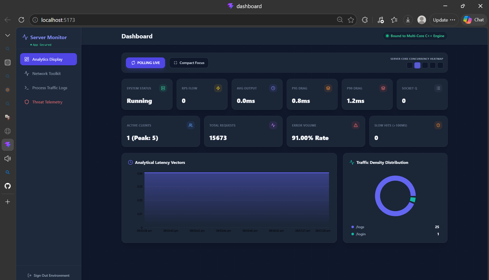
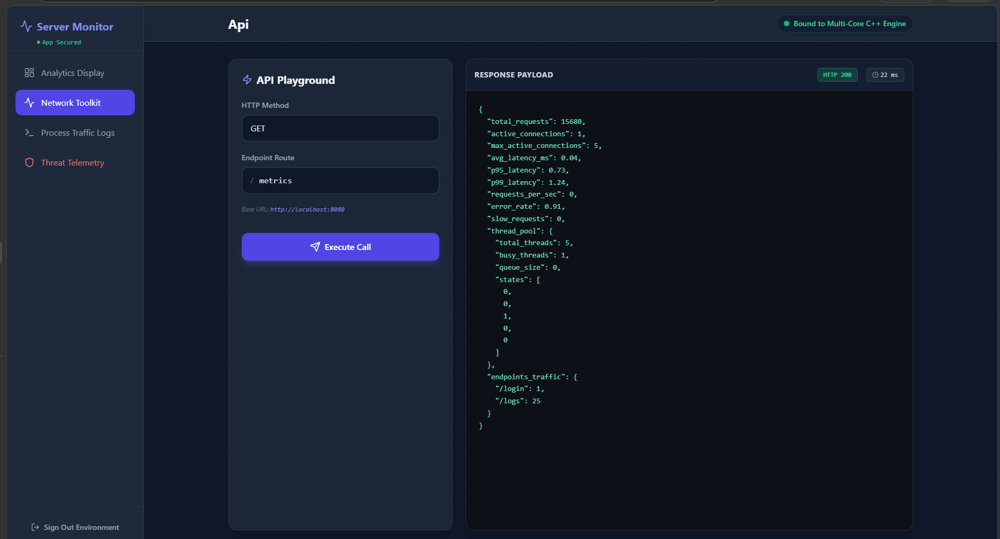
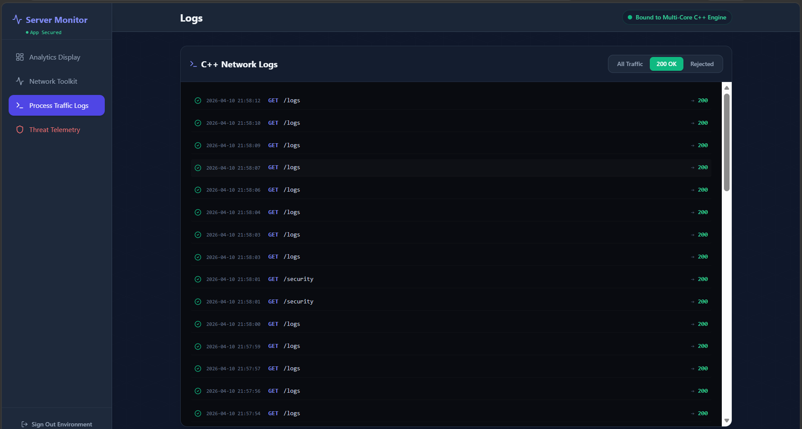
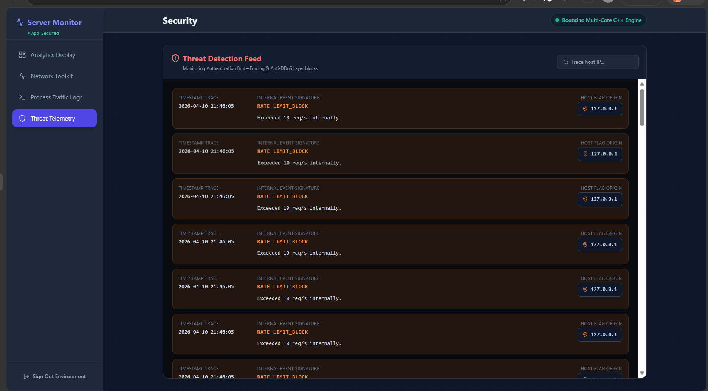

# ThreadServe Dashboard

A high-performance, real-time monitoring dashboard for the **ThreadServe** multi-threaded C++ server engine. This dashboard provides deep insights into server health, traffic patterns, and security telemetry with a premium dark-mode interface.

## 🚀 Key Features

-   **Analytics Display**: Real-time visualization of Requests Per Second (RPS), Latency (Avg, P95, P99), Active Connections, and Worker Thread Pool concurrency.
-   **Network Toolkit**: Interactive API testing suite for debugging and server interaction.
-   **Process Traffic Logs**: Live stream of processed traffic logs for immediate visibility into server activity.
-   **Threat Telemetry**: Integrated security monitoring and threat detection telemetry.

## 🖼️ Dashboard Previews

### Overview and Analytics

*Real-time metrics and latency distribution*

### Network Toolkit

*API interaction and testing interface*

### Traffic Logs

*Live process traffic stream*

### Threat Telemetry

*Security monitoring and intrusion detection*

## 🛠️ Built With

-   **React 19**: Modern UI component architecture.
-   **Vite**: Next-generation frontend tooling.
-   **TailwindCSS**: Utility-first styling for a premium aesthetic.
-   **Recharts**: Composable charting library for real-time visualization.
-   **Lucide React**: Clean and consistent iconography.

## 🚦 Getting Started

### Prerequisites
-   Node.js (latest stable version)
-   npm or yarn

### Installation
1.  Clone the repository:
    ```bash
    git clone https://github.com/Ramitha-R6/ThreadServe.git
    ```
2.  Navigate to the dashboard directory:
    ```bash
    cd dashboard
    ```
3.  Install dependencies:
    ```bash
    npm install
    ```
4.  Launch the development server:
    ```bash
    npm run dev
    ```

## 🔐 Security
The dashboard is secured and requires a valid JWT token from the ThreadServe core engine to access sensitive telemetry data.

---
Built with ❤️ for High-Performance Computing.
